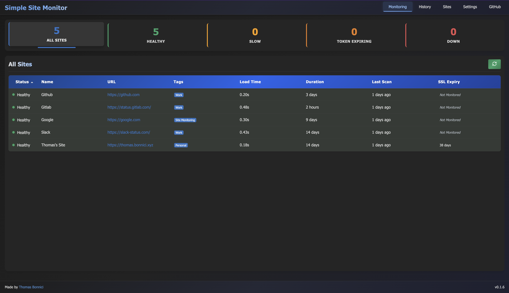
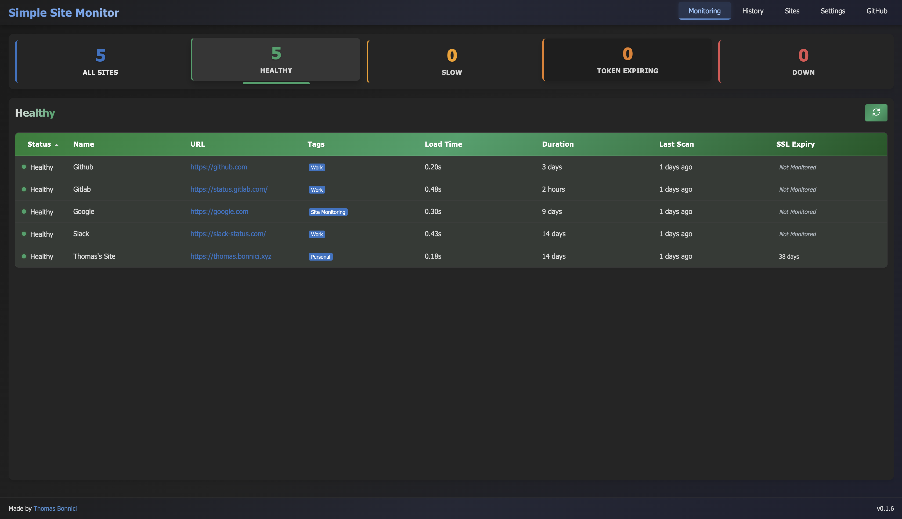
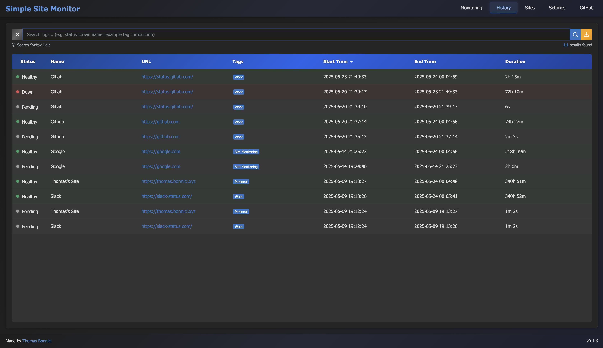
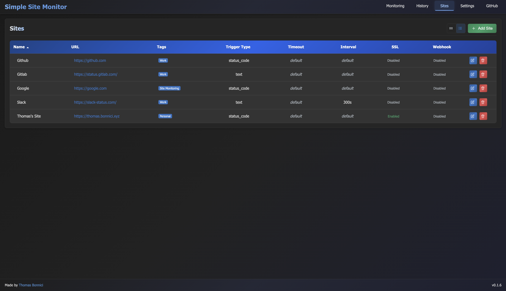
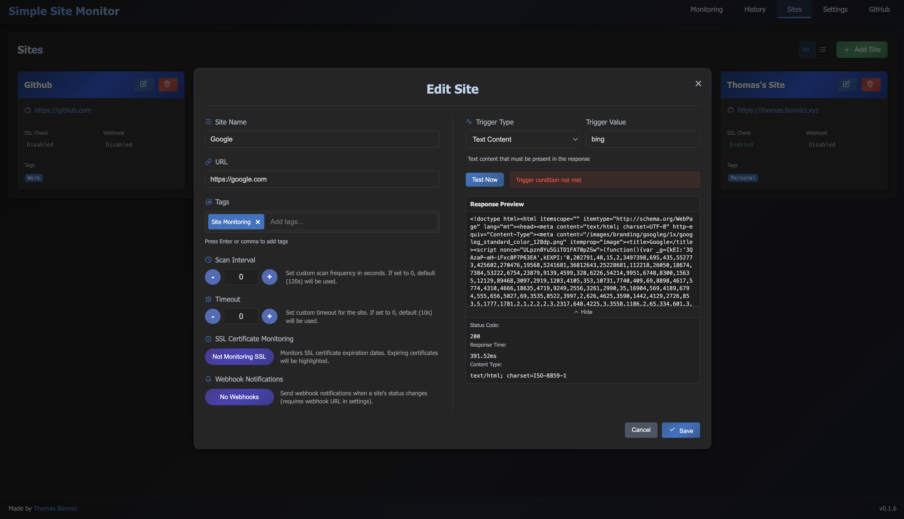
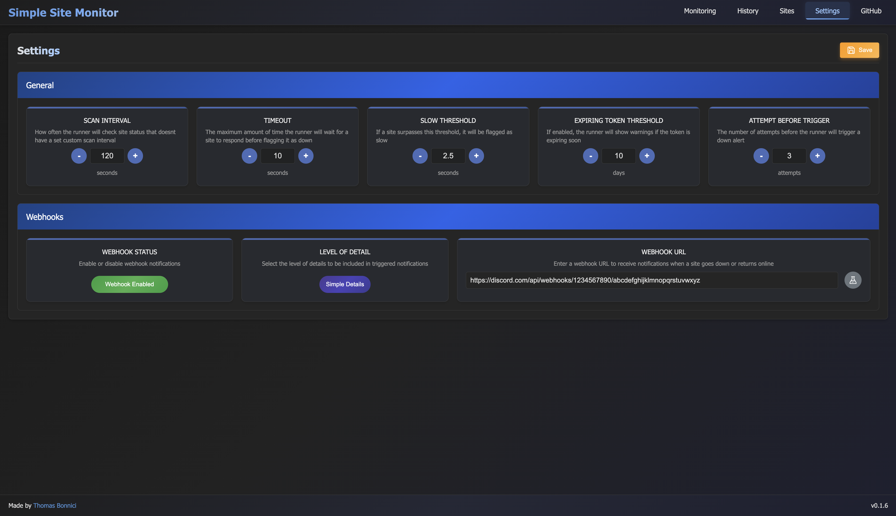

# Simple Site Monitor

A robust web application for monitoring website uptime, performance, and SSL certificate expiration. Simple Site Monitor provides an easy-to-use dashboard to track the health of your websites in real-time.



## Features

- **Real-time Website Monitoring**: Track website availability and response times
- **SSL Certificate Monitoring**: Get alerted when SSL certificates are close to expiration
- **Configurable Thresholds**: Set custom thresholds for response times and monitoring intervals
- **Webhook Notifications**: Receive alerts via Discord, Slack, or custom webhooks when site status changes
- **Advanced Log History**: View and search through historical monitoring data with powerful filtering
- **Intelligent Search**: Smart syntax highlighting and autocomplete for search queries
- **Tagging System**: Organize and filter sites with custom tags for better categorization
- **Responsive UI**: Clean, modern interface that works on desktop and mobile
- **Docker Support**: Easy deployment with Docker and Docker Compose

## Screenshots

### Dashboard


### History


### Sites Management



### Settings


## Architecture

The application consists of two main components:

1. **Web Interface** - A FastAPI web application providing the UI and API endpoints
2. **Runner** - A monitoring service that periodically checks website status

Both components can be deployed together using Docker Compose or run separately.

## Installation

### Using Docker (Recommended)

```bash
# Clone the repository
git clone https://github.com/yourusername/Simple-Site-Monitor.git
cd Simple-Site-Monitor

# Build and start the Docker containers
docker compose up -d --build
```

The application will be available at http://localhost:8000

### Manual Installation

```bash
# Clone the repository
git clone https://github.com/yourusername/Simple-Site-Monitor.git
cd Simple-Site-Monitor

# Set up environment with PDM
pdm install

# Run the web interface
pdm run uvicorn main:app --reload

# In a separate terminal, run the monitor
pdm run python runner.py
```

## Configuration

### Main Configuration

The application settings are stored in `data/config.json`:

```json
{
  "default_scan_interval": 30,        // Default scan frequency in seconds
  "default_timeout": 10,              // Default timeout in seconds
  "default_slow_threshold": 2.5,      // Response time threshold to mark as "slow"
  "expiring_token_threshold": 10,     // Days before SSL expiration to trigger alert
  "attempt_before_trigger": 3,        // Number of failed attempts before marking site as down
  "include_error_debugging": false,   // Include detailed error info in notifications
  "webhooks": {
    "type": "discord",                // Webhook type: discord, slack, custom
    "url": "https://your-webhook-url", // Webhook URL
    "enabled": false                  // Enable/disable webhooks
  },
  "sites": [
    // Array of sites to monitor
  ]
}
```

### Docker Environment Variables

In the `docker-compose.yml` file, you can configure:

- `TZ`: Timezone setting (default: UTC)
- `PYTHONUNBUFFERED`: Python output buffering (set to 1 for Docker logs)

### Adding Sites to Monitor

Sites can be added through the web interface or by editing the config.json file directly.

Each site configuration includes:

- **Name**: Display name for the site
- **URL**: The URL to monitor
- **Trigger**: Condition to determine if site is up (status code or text content)
- **Timeout**: Custom timeout in seconds (0 to use default)
- **Scan Interval**: Custom scan frequency in seconds (0 to use default)
- **SSL Monitoring**: Enable/disable SSL certificate expiration monitoring
- **Webhook**: Enable/disable webhook notifications for this site
- **Tags**: Custom tags to categorize and filter sites (e.g., "production", "development", "client-name")

## Components

### Web Interface

The web interface provides:

- Dashboard with real-time site status
- Site management interface
- Settings configuration
- History page with advanced search capabilities
- API endpoints for the runner

### History Page

The history page offers sophisticated log viewing capabilities:

- **Dynamic Pagination**: Automatically adjusts rows per page based on available screen height
- **Advanced Search**: Filter logs with intuitive query syntax
- **Syntax Highlighting**: Filter tags (status:, name:, url:, tag:) are highlighted in blue for better readability
- **Keyboard Navigation**: Tab completion and arrow key navigation for efficient searching
- **Real-time Filtering**: Instantly filter through hundreds of log entries

Search syntax examples:
- `status:down` - Find logs with down status
- `name:example` - Find logs for a specific site name
- `url:example.com` - Filter by URL
- `tag:production` - Find logs for sites with a specific tag

### Runner

The runner service:

- Periodically checks configured websites
- Updates status in the database
- Sends webhook notifications when status changes
- Verifies SSL certificate expiration dates

### Database

The application uses SQLite to store:

- Site status history
- Performance metrics
- Configuration data

## API Endpoints

The application provides several API endpoints:

- `/api/sites` - Manage monitored sites
- `/api/settings` - Update global settings
- `/api/webhooks` - Configure webhook notifications

## Docker Implementation

The project includes Docker support with two services:

1. **web** - The web interface container
   ```dockerfile
   FROM python:3.13-slim
   WORKDIR /app
   COPY . .
   RUN pip install --no-cache-dir pdm && \
       pdm install --no-self && \
       chmod -R 777 /app/data && \
       chmod +x /app/docker-entrypoint.sh
   EXPOSE 8000
   ENTRYPOINT ["/app/docker-entrypoint.sh"]
   CMD ["pdm", "run", "uvicorn", "main:app", "--host", "0.0.0.0", "--port", "8000"]
   ```

2. **runner** - The monitoring service container
   ```dockerfile
   FROM python:3.13-slim
   WORKDIR /app
   COPY . .
   ENV PYTHONUNBUFFERED=1
   RUN pip install --no-cache-dir pdm && \
       pdm install --no-self && \
       chmod -R 777 /app/data && \
       chmod +x /app/docker-entrypoint.sh
   ENTRYPOINT ["/app/docker-entrypoint.sh"]
   CMD ["pdm", "run", "python", "runner.py"]
   ```

The services are orchestrated using Docker Compose:

```yaml
version: '3.8'

services:
  web:
    build: .
    ports:
      - "8000:8000"
    volumes:
      - ./data:/app/data
    restart: unless-stopped
    environment:
      - TZ=UTC  # Set to your timezone

  runner:
    build: 
      context: .
      dockerfile: Dockerfile.runner
    volumes:
      - ./data:/app/data
    restart: unless-stopped
    environment:
      - TZ=UTC  # Set to your timezone
      - PYTHONUNBUFFERED=1
    depends_on:
      - web
```

## Troubleshooting

### Time Zone Issues

If you experience issues with timestamps or time calculations, ensure that the timezone in your `docker-compose.yml` file matches your local timezone.

### Database Permissions

The application requires write permissions to the `data` directory. If running without Docker, ensure your user has the appropriate permissions.

### Webhook Testing

You can test webhook notifications from the Settings page without triggering actual alerts.

### First Run Configuration

On first run, the Docker containers will automatically create a `config.json` file from the sample configuration if one doesn't exist. You can then customize this file through the web interface or by directly editing it.

## License

This project is licensed under the MIT License - see the LICENSE file for details.
